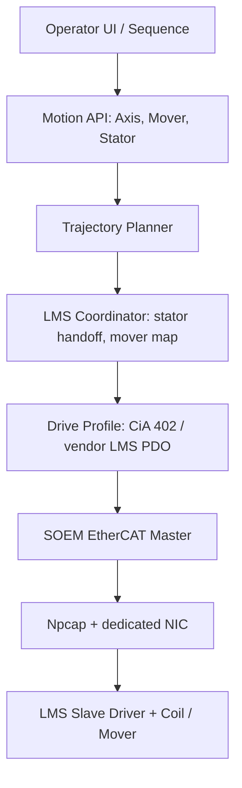

# WMX3 Benchmark Notes and LMS Roadmap

## 벤치마킹 방향

WMX3를 그대로 복제하는 것이 아니라, 공개 정보에서 확인되는 구조적 강점을
독립 구현의 요구사항으로 변환합니다.

- PC 기반 software motion controller
- EtherCAT Soft Master와 Motion API의 계층 분리
- 실시간 주기 태스크와 동기화 구조
- C/C++/C#/Python 등 외부 언어 연동 가능한 API 지향 설계
- 진단, 로깅, 시뮬레이션, 테스트 도구를 포함하는 개발 환경
- 다축 동기/보간 제어와 device 확장성

## 공개 EtherCAT Master 선택

현재 저장소는 SOEM 2.x 소스 트리입니다. Windows PC에서 빠르게 시작하려면
SOEM이 가장 현실적입니다.

- SOEM: Windows/Linux 모두 사용 가능, 가볍고 애플리케이션 내장형에 적합
- EtherLab/IgH: Linux production/RT 환경에 강점, Windows 개발 목표와는 거리가 있음
- 상용 EC-Master/TwinCAT/WMX3: 완성도와 진단 기능은 우수하지만 독립 open-source 구현과는 목적이 다름

따라서 1단계는 SOEM 기반 Windows 개발 환경, 2단계는 LMS motion layer,
3단계는 필요 시 RTOS/Linux RT로 실시간성 격상입니다.

## 목표 아키텍처

## 현재 구현된 1차 산출물

- `apps/lms_master/lms_master.c`
  - NIC 목록 조회
  - EtherCAT slave scan
  - process-data mapping
  - SAFE_OP/OP 전환
  - cyclic process-data monitor
  - LMS stator CSV validation
  - demo trapezoid planner
  - 명시 옵션이 있을 때만 CiA 402 PDO 출력
- `apps/ethercat_gui/ethercat_gui.c`
  - Windows native GUI
  - public DLL API 사용 예제
  - adapter 선택 및 연결/해제
  - slave module/status table
  - PDO input/output snapshot
  - SDO read browser
  - cycle timing, WKC, DC time, CRC/FCS 표시
  - event log
- `ethercat_dll`
  - `ethercat_dll.dll`, `ethercat_dll.lib`, `ethercat_master.h` 배포 구조
  - SOEM context와 EtherCAT cyclic worker thread를 내부 구현으로 은닉
  - GUI/사용자 앱은 공개 API만 사용
- `config/lms_bosch_sample.csv`
  - Bosch-style LMS stator/coil segment map 샘플
- `.vscode/*`
  - VS Code CMake preset, build task, GUI/debug profile

## 단계별 개발 로드맵

### M0. EtherCAT Master 개발 환경

완료 범위:
- Windows + VS Code + CMake preset
- SOEM 기반 `lms_master` 실행 파일
- adapter list, scan, cyclic monitor
- SOEM 기반 `ethercat_gui` 진단 화면

다음 검증:
- 실제 EtherCAT NIC에서 `--list-adapters`
- LMS slave chain에서 `--scan`
- `ethercat_gui.exe`에서 slave status/PDO/SDO/통신 통계 확인

### M1. Slave Driver bring-up

개발 항목:
- 각 LMS Slave Driver의 ESI 파일 수집
- PDO map 자동/반자동 추출
- CoE SDO init script 적용
- DC sync cycle/shift 설정
- vendor/product/revision 기반 slave profile 매칭

산출물:
- `config/slaves/*.csv` 또는 JSON profile
- `lms_master --dump-pdo`
- `lms_master --apply-init`

### M2. CiA 402 Motion Axis

개발 항목:
- Statusword decoder 강화
- Fault reset, shutdown, switch-on, enable-operation sequence
- CSP/CSV/CST mode 선택
- software limit, following error, quick-stop

기본 정책:
- drive enable은 별도 확인 옵션으로만 수행
- E-stop, limit input, STO 상태를 먼저 읽고 enable

### M3. LMS Coordinator

개발 항목:
- mover global coordinate
- active stator selection
- adjacent stator overlap/handoff
- coil segment ownership
- multi-mover 충돌 방지
- mover/stator calibration table

핵심 모델:
- Stator는 전역 좌표 구간을 가진 actuator segment
- Mover는 영구자석 payload이며 active segment 위에서만 force/position command를 받음
- 구간 경계에서는 두 stator가 overlap blending 또는 handoff protocol을 수행

### M4. Motion Planner

개발 항목:
- trapezoid/S-curve trajectory
- point-to-point, jog, home, stop, quick-stop
- path queue와 look-ahead
- 반복 정밀도/settling 로그

### M5. 진단/로그/GUI

개발 항목:
- cycle jitter histogram
- WKC/state/fault timeline
- per-axis trace logging
- PDO watch table
- LMS track view

### M6. 실시간성 강화

Windows 일반 OS에서 검증한 뒤, 고속/고정밀 요구가 있으면 다음을 비교합니다.

- Windows + RTX64 + SOEM 또는 상용 master
- Linux PREEMPT_RT/Xenomai + EtherLab
- Windows 상용 stack 유지 + 자체 LMS/motion API 계층

## 실제 장비 투입 전 체크리스트

- EtherCAT 전용 NIC와 장비망 분리
- Npcap 설치 및 관리자 권한 확인
- 모든 slave가 PRE_OP/SAFE_OP/OP로 정상 전환되는지 확인
- PDO offset을 제조사 문서/ESI 기준으로 확인
- STO/E-stop/limit input을 먼저 검증
- `--enable-drive-outputs`는 low power 또는 motor power off 조건에서 최초 검증
- Mover가 없는 상태에서 coil/stator command가 안전한지 확인
